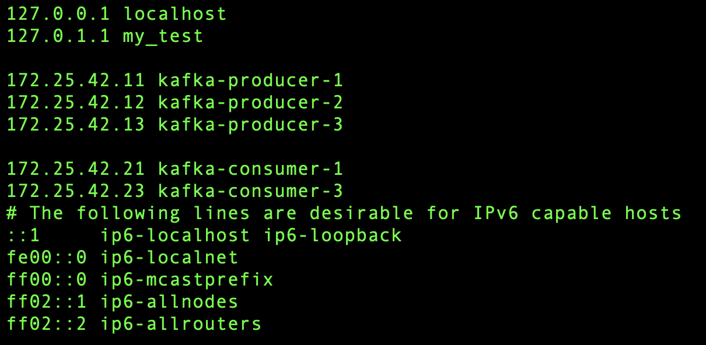

## Project description

В данном проекте продемонстрировано развертывание отказоустойчивого кластера Apache Kafka из 3-х узлов для Producer и 3-х узлов для Consumer. 
* В первом разделе **Node preparation** происходит подготовка i-го узла кластера (Consumer и Producer настраиваются одинаково). 
* Во втором разделе **Setup node step by step** показан процесс установки Kafka на i-й узел. 
* В третьем разделе **Fast install kafka** инструкция по быстрой установки i-го узла кластера с помощью bash скрипта.  
* В четвертом разделе **Set host** инструкция настройки видимости узлов кластера
* В пятом разделе **Kafka start** запускаем кафку
* В шестом разделе **Commands for kafka** приведены примеры основных команд для работы с kafka
* В 7 разделе **Python testing** продемонстрированы примеры работы с kafka с помощью python

В ниже приведенных скриптах, происходит настройка узла **kafka-producer-1** . При установке других узлов, заменить необходимые значения.

### Node names
Список имен хостов кластера:
- kafka-producer-1
- kafka-producer-2
- kafka-producer-3
- kafka-consumer-1
- kafka-consumer-2
- kafka-consumer-3

## 1. Node preparation
### 1. Create user kafka
1. Создаем пользователя kafka и добавляем в группу sudo
    - sudo useradd -m kafka
    - sudo passwd kafka 
    - sudo usermod -aG sudo kafka

2. Для пользователя Kafka изменяем  **sh** на  **bash** 
    - sudo vim /etc/passwd

    
    

3. Переключаемся на пользователя Kafka и возвращаемся в его домашнюю директорию
    - su kafka 
    - cd

### 2. Preporation

1. Задаем имя хоста
    - sudo hostnamectl set hostname kafka-producer-1

## 2. Setup node step by step
### 1. Install kafka
1. Скачиваем архив kafka с официального сайта
    - wget https://downloads.apache.org/kafka/3.6.1/kafka_2.12-3.6.1.tgz
2. Разархивируем его
    - tar -xvzf kafka_2.12-3.6.1.tgz
3. Создаем директорию **kafka_server_1** для сервера и перемещаем содержимое kafka_2.12-3.6.1 в созданну директорию
    - mkdir kafka_server_1
    - mv kafka_2.12-3.6.1/* /home/kafka/kafka_server_1
4. Удаляем ненужные архив и папку
    - rm -rf kafka_2.12-3.6.1.tgz
    - rm -rf kafka_2.12-3.6.1

### 2. Set configs for zookeeper

1. В файле **config/zookeeper.properties** устанавливаем конфигурации и ip адреса узлов кластера. В данном разделе указываем либо адреса всех узлов Producer либо всех узлов Consumer. 
    - tickTime=2000
    - initLimit=10
    - syncLimit=5
    - server.1 = 172.25.42.11:2888:3888
    - server.2 = 172.25.42.12:2888:3888
    - server.3 = 172.25.42.13:2888:3888

2. Cоздаем папку для zookeepr
    - mkdir -p /tmp/zookeeper

3. Записываем broker_id в файл myid. Так как у нас 3 нодный кластер, то broker_id принимает значения 1,2,3 
    - "1" > /tmp/zookeeper/myid

### 3. Set configs fo kafka

1. в файле **kafka_server_1/config/server.properties** устанавливаем слудующие настройки. В zookeeper.connect перечисляем через запятую ip адреса с портами 3 узлов (либо Producer либо Consumer)
    - broker.id=1
    - offsets.topic.replication.factor=3
    - transaction.state.log.replication.factor=3
    - zookeeper.connect=172.25.42.11:2181,172.25.42.12:2181,172.25.42.13:2181
    - dirs=/tmp/kafka-logs-1

### 4. Create zookeeper.service file
Настраиваем сервисную службу для zoookeeper. Как и в других пунктах, приведен пример для 1 узла кластера Producer. При установке на других узлов, скорректировать путь в **[Service]**
1. Создаем файл **/etc/systemd/system/zookeeper.service**
2. Вносим в файл следующий текст:

[Unit]
Requires=network.target\
remote-fs.target
After=network.target\
remote-fs.target

[Service]
Type=simple
User=kafka
ExecStart=/bin/sh -c "home/kafka/kafka_server_1/bin/zookeeper-server-start.sh home/kafka/kafka_server_1/config/zookeeper.properties"
ExecStop=home/kafka/kafka_server_1/bin/zookeeper-server-stop.sh

[Install]
WantedBy=multi-user.target

### 5. Create kafka.service file
Настраиваем сервисную службу для Kakfa. Как и в предыдущем пункте, приведен пример для 1 узла кластера Producer. При установке на других узлов, скорректировать путь в **[Service]**
1. Создаем файл /etc/systemd/system/kafka.service
2. Вносим в файл следующий текст:

[Unit]
Requires=zookeeper.service\
After=zookeeper.service

[Service]
Type=simple\
User=kafka\
ExecStart=/bin/sh -c "home/kafka/kafka_server_1/bin/kafka-server-start.sh home/kafka/kafka_server_1/config/server.properties > home/kafka/kafka_server_1/kafka.log 2>&1"\
ExecStop=home/kafka/kafka_server_1/bin/kafka-server-stop.sh\
Restart=on-abnormal

[Install]
WantedBy=multi-user.target

### 6. Distribution of rights

1. Раздаем необходимые права и назначаем владельца директорий
    - chmod -R  755 /tmp/zookeeper
    - chown -R kafka:kafka /tmp/zookeeper
    - chown -R kafka:kafka /home/kafka/kafka_server_1

### 7. Systemctl

1. Перезагружаем демона
    - sudo systemctl daemon-reload
2. Включаем автоматический запуск
    - sudo systemctl enable zookeeper
    - sudo systemctl enable kafka

## 3. Fast install kafka
Вышеприведенные шаги, укомплектованы в один bash скрипт.
1. Открыть скрипт и заполнить своими значениями переменные HOST
2. Запустить скрипт
    - sudo sh kafka-install.sh

Опционально будет изучить содержание скрипта **kafka-install.sh**

## 4. Set host
При проблеме с видимостью между узлами, может потребоваться внесение информации о связанных узлах с данным.
1. Для настройка видимости хостов, открывам **/etc/hosts**
    - sudo vim /etc/hosts 
2. Для Producer вносим все хосты узлов Producer, кроме текущего.
3. Для Consumer вносим все хосты узлов Consumer и все хосты узлов Producer, кроме текущего.

## 5. Kafka start

1. Запускаем службу zookeeper
    - sudo systemctl start zookeeper
2. Проверяем работаспособность
    - sudo systemctl status zoookeeper
3. Запускаем службу kafka
    - sudo systemctl start kafka
4. Проверяем работаспособность
    - sudo systemctl status kafka

## 6. Commands for kafka

Cоздание топика
- ./bin/kafka-topics.sh --create --topic test --bootstrap-server 172.25.42.11:9092,172.25.42.12:9092,172.25.42.13:9092 --replication-factor 2 --partitions 3

Посмотреть созданные топики
- ./bin/kafka-topics.sh --list --bootstrap-server 172.25.42.11:9092,172.25.42.12:9092,172.25.42.13:9092

Посмотреть информацию о топике
- ./bin/kafka-topics.sh --describe --topic test --bootstrap-server 172.25.42.11:9092,172.25.42.12:9092,172.25.42.13:9092

Запись данных в топик 
- ./bin/kafka-console-producer.sh --topic test --bootstrap-server 172.25.42.11:9092,172.25.42.12:9092,172.25.42.13:9092

Чтение данных из топика
- ./bin/kafka-console-consumer.sh --topic test --bootstrap-server 172.25.42.11:9092,172.25.42.12:9092,172.25.42.13:9092 --from-beginning

Удаление топика
- ./bin/kafka-topics.sh --delete  --topic test --bootstrap-server 172.25.42.11:9092,172.25.42.12:9092,172.25.42.13:9092 

## 7. Python testing

1. Создаем новое виртуальное окружение
    - python3 -m venv venv
2. Активируем его
    - source venv/bin/activate
3. Устанавливаем необходимые библиотеки
    - pip install -r requirements.txt
